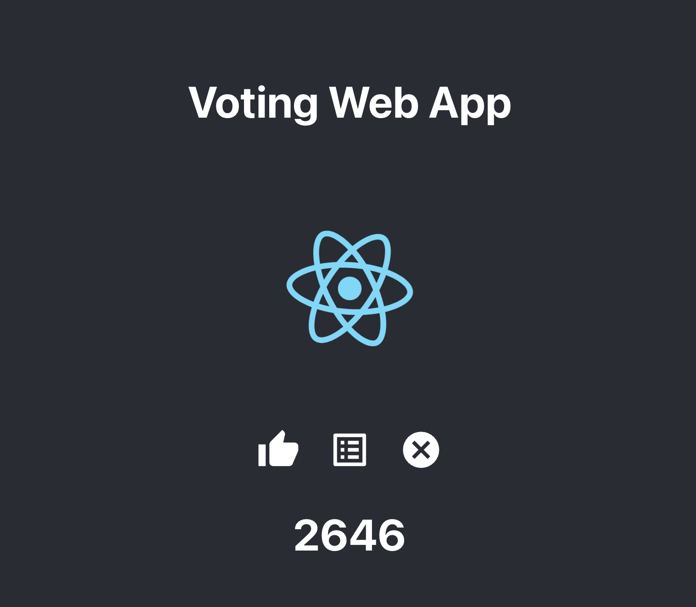

## Compose sample application

### Use with Docker Development Environments

You can open this sample in the Dev Environments feature of Docker Desktop version 4.12 or later.

[Open in Docker Dev Environments ](https://open.docker.com/dashboard/dev-envs?url=https://github.com/mshahzeb/web-app-2023)

### Go server with an Nginx proxy and a MySQL database with a React Frontend

A simple web application with a React frontend and a Go + MySQL backend.
Nginx server handles web requests for both React and Go.

## Enabling FARO
WIP

## Env variables
Create an `env.local` file in `frontend/` and set the following values
| Name                                 | Value                                                        |
|--------------------------------------|--------------------------------------------------------------|
| REACT_APP_API_URL                    | http://localhost:8080                                        |
| REACT_APP_FARO_COLLECTOR_URL         | https://faro-collector-prod-us-east-0.grafana.net/collect/xyz|
| REACT_APP_FARO_COLLECTOR_NAME        | web-app-2023                                                 |
| REACT_APP_FARO_COLLECTOR_ENVIRONMENT | production                                                   |

## Deploy with docker compose

```shell
$ docker compose up -d
...
[+] Running 6/6
 [+] Running 4/4
 ✔ Container web-app-2023-db-1        Healthy                                                0.5s 
 ✔ Container web-app-2023-backend-1   Running                                                0.0s 
 ✔ Container web-app-2023-frontend-1  Running                                                0.0s 
 ✔ Container web-app-2023-proxy-1     Running                                                0.0s 
```

## Expected result

Listing containers must show three containers running and the port mapping as below:
```shell
$ docker compose ps
NAME                      IMAGE                   COMMAND                  SERVICE             CREATED             STATUS                    PORTS
web-app-2023-backend-1    web-app-2023-backend    "/code/bin/backend"      backend             About an hour ago   Up 59 minutes             
web-app-2023-db-1         mysql:8                 "docker-entrypoint.s…"   db                  31 minutes ago      Up 31 minutes (healthy)   0.0.0.0:3306->3306/tcp, 33060/tcp
web-app-2023-frontend-1   web-app-2023-frontend   "docker-entrypoint.s…"   frontend            About an hour ago   Up 59 minutes             3000/tcp
web-app-2023-proxy-1      nginx                   "/docker-entrypoint.…"   proxy               About an hour ago   Up 59 minutes             0.0.0.0:80->80/tcp, 0.0.0.0:8080->8080/tcp
```

After the application starts, navigate to `http://localhost:80` in your web browser.


Stop and remove the containers
```shell
$ docker compose down
```

## Running k6

Set the appropriate environment variables in a .env file in the project root
```
K6_PROJECT_ID=<k6 project ID for testing>
```

Use the following command to run the test locally and send test report to k6 cloud
```
k6 run --out cloud k6-tests/test1.js
```